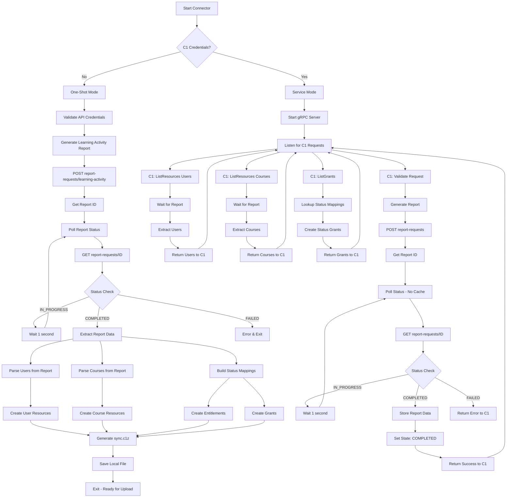

# `baton-percipio-report` [](https://pkg.go.dev/github.com/iiiatthew/baton-percipio-report)

`baton-percipio-report` is a connector for built using the [Baton SDK](https://github.com/conductorone/baton-sdk).

Check out [Baton](https://github.com/conductorone/baton) to learn more the project in general.

## Summary

This connector is a refactored version of the standard `baton-percipio` connector. Unlike `baton-percipio`, this connector calls only the Percipio Reporting Services endpoints to fetch a learning activity report, instead of making separate calls to the Content Discovery and User Management Services endpoints.

### Key Differences

**Simplified Architecture**: Uses a single learning activity report to extract the minimum required user and course data in order to retrieve course completion statuses for the users instead of making multiple paginated API calls to separate endpoints.

**Optimized Performance**: Features a hybrid HTTP client approach that eliminates caching issues during report status polling while maintaining performance for other API calls. Reports are generated once per sync cycle with thread-safe state management.

**Testing Optimization**: Introduces `--lookback-days` and `--lookback-years` flags to control how far back to fetch learning activity data for testing purposes. The standard `baton-percipio` connector is coded to request 10 years of data. For development and testing, use `--lookback-days=1` or `--lookback-days=30` to generate reports much faster and speed up connector testing and validation.

## Building the Connector Binary

The repo includes a `Makefile` for building, adding and updating dependencies, and linting

```bash
make build
```

If you don't want to use `make` you can build the binary with:

```bash
go build -o dist/baton-percipio-report ./cmd/baton-percipio-report
```

## Running the Connector

### Running in Local Test Mode (One-Shot)

Running the connector without ConductorOne credentials will trigger one-shot mode which generates a c1z file to use for testing and manual upload. By default this mode will create a sync.c1z file, in the current directory, that can be examined using the [Baton Toolkit](https://github.com/conductorone/baton).

#### Generating the .c1z file

```bash
baton-percipio-report \
  --api-token <PERCIPIO_API_TOKEN> \
  --organization-id <PERCIPIO_ORG_ID> \
  --lookback-days 1 \
  --log-level debug
```

#### Validating the generated c1z file

Requires the [Baton Toolkit](https://github.com/conductorone/baton) to be installed on your local machine.

```bash
baton resources -f sync.c1z
```

```bash
baton grants -f sync.c1z
```

```bash
baton explorer -f sync.c1z
```

### Running in Service Mode / Continuous Sync Mode (Production)

Once you are satified that the local testing mode execution generates the expected resources, entitlements, and grants as expected, you can run the connector in service mode. Service mode runs as a continuous process which ConductorOne calls for sync operations once per hour. To run the connector in service mode, pass your ConductorOne connector credentials as commandline flags, this will automatically trigger service mode.

Run as a service for ConductorOne:

```bash
baton-percipio-report \
  --api-token <PERCIPIO_API_TOKEN> \
  --organization-id <PERCIPIO_ORG_ID> \
  --client-id <BATON_CLIENT_ID> \
  --client-secret <BATON_CLIENT_SECRET> \
```

# Baton Percipio Report Connector: Architecture Flow

This document illustrates how the baton-percipio-report connector works in both one-shot mode (local testing) and service mode (production integration with ConductorOne).

## Execution Modes

The connector operates in two distinct modes based on the presence of ConductorOne credentials:

- **One-Shot Mode**: No `--client-id` or `--client-secret` provided → Generates local `sync.c1z` file
- **Service Mode**: C1 credentials provided → Runs as continuous service for ConductorOne platform

## Connector Flow Diagram



# `baton-percipio-report` Command Line Usage

```
baton-percipio-report

Usage:
  baton-percipio-report [flags]
  baton-percipio-report [command]

Available Commands:
  capabilities       Get connector capabilities
  completion         Generate the autocompletion script for the specified shell
  config             Get the connector config schema
  help               Help about any command

Flags:
      --api-token string                                 required: The Percipio Bearer Token ($BATON_API_TOKEN)
      --client-id string                                 The client ID used to authenticate with ConductorOne ($BATON_CLIENT_ID)
      --client-secret string                             The client secret used to authenticate with ConductorOne ($BATON_CLIENT_SECRET)
      --external-resource-c1z string                     The path to the c1z file to sync external baton resources with ($BATON_EXTERNAL_RESOURCE_C1Z)
      --external-resource-entitlement-id-filter string   The entitlement that external users, groups must have access to sync external baton resources ($BATON_EXTERNAL_RESOURCE_ENTITLEMENT_ID_FILTER)
  -f, --file string                                      The path to the c1z file to sync with ($BATON_FILE) (default "sync.c1z")
  -h, --help                                             help for baton-percipio-report
      --log-format string                                The output format for logs: json, console ($BATON_LOG_FORMAT) (default "json")
      --log-level string                                 The log level: debug, info, warn, error ($BATON_LOG_LEVEL) (default "info")
  -d, --lookback-days int                                How many days back of learning activity data to fetch ($BATON_LOOKBACK_DAYS)
  -y, --lookback-years int                               How many years back of learning activity data to fetch (default: 10) ($BATON_LOOKBACK_YEARS) (default 10)
      --organization-id string                           required: The Percipio Organization ID ($BATON_ORGANIZATION_ID)
      --otel-collector-endpoint string                   The endpoint of the OpenTelemetry collector to send observability data to (used for both tracing and logging if specific endpoints are not provided) ($BATON_OTEL_COLLECTOR_ENDPOINT)
  -p, --provisioning                                     This must be set in order for provisioning actions to be enabled ($BATON_PROVISIONING)
      --skip-full-sync                                   This must be set to skip a full sync ($BATON_SKIP_FULL_SYNC)
      --sync-resources strings                           The resource IDs to sync ($BATON_SYNC_RESOURCES)
      --ticketing                                        This must be set to enable ticketing support ($BATON_TICKETING)
  -v, --version                                          version for baton-percipio-report

Use "baton-percipio-report [command] --help" for more information about a command.
```
